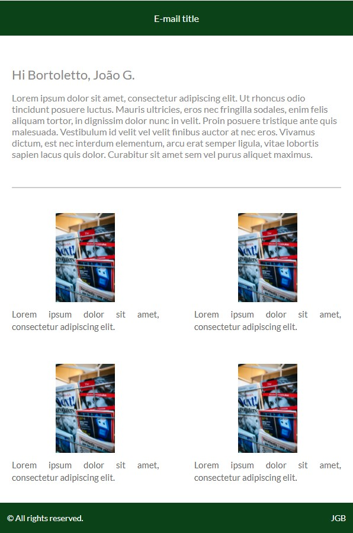

# 💻 E-mail Template

<p align="center">This project is a template for email...</p>

<br/>

# 📓 Contents:

- About
    - [Features](#Features)
- Contents,
- How to use
    - [Prerequisites](#Prerequisites)
    - [Running the project](#Running-the-project)
- Tests,
- Technologies,
- Icons.

<br/>

# About:

### Features:

- [x] Create Title
- [x] Create Project
- [x] Create Description
- [x] Performed Tests

<br/>

# 📝 How to use:

<br/>

### Prerequisites:

You need to have the following tools installed on your machine: [Git](https://git-scm.com) and [VSCode](https://code.visualstudio.com/)

<br/>

### Running the project:

```bash
# Clone this repository
$ git clone <https://github.com/bortolettojoaog/template_email.git>

# Access the project folder through terminal/cmd
$ cd template_email

# Open the project in visual studio code
$ code .

# Open the index.html file or use the `Live Server` extension
```

<br/>

# ✔️ Tests:
<h1 align="center">
    
</h1>

<br/>

# 🛠️ Technologies:

The following tools were used in building the project:

- [HTML](https://pt.wikipedia.org/wiki/HTML)

<br/>

# 📁 Icons:

- :package: new functionality
- :up: update
- :bug: bug fix
- :checkered_flag: release

<br/>

---

<p align="center">
    Made with ❤️ by João Guilherme Bortoletto 👋
</p>

<p align="center">
    <a href="https://www.linkedin.com/in/bortolettojoaog/">See my LinkedIn</a>
</a>